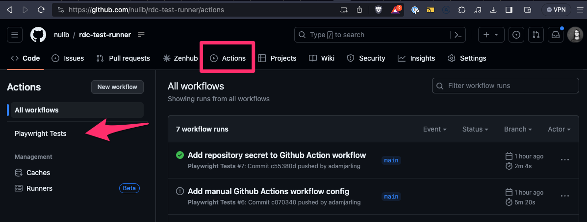
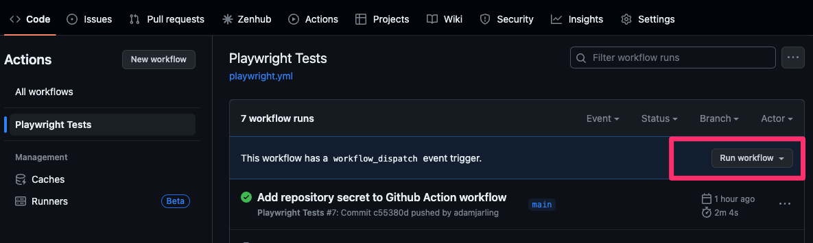

# RDC Test Runner

A repository of [Playwright](https://playwright.dev/) tests for running and writing end to end tests. This repository tests can be organized into folders representing NULib applications. The tests can be run locally or in a CI environment.

## Getting Started

### Install

Run the following from a terminal window on your machine

```bash
# Clone the repository (only need to do this once)
git clone git@github.com:nulib/rdc-test-runner.git

# Navigate into your new folder
cd rdc-test-runner

# Install dependencies
npm install # if you get errors, try `npm install --legacy-peer-deps`
```

#### VSCode

VSCode is an IDE application that can be used to write and run tests.

Install [VSCode](https://code.visualstudio.com/download) and the following extensions:

- [Playwright Test for VSCode](https://marketplace.visualstudio.com/items?itemName=ms-playwright.playwright)

### Set up Authenticated User

We'll set up a user that can log in to the application. This user will be used to run tests that require authentication. Create a new file in the root of the repository called `.env` and add the following lines to it:

```bash
AUTH_USER=[VALUE_GOES_HERE]
AUTH_PASSWORD=[VALUE_GOES_HERE]
```

Contact a member of the NULib RDC team for the values to use for `AUTH_USER` and `AUTH_PASSWORD`.

## Run tests

Tests can be run locally or in a CI environment.

### Locally

Test scripts/files for Digital Collections are located in the `/tests/dc` directory. For example, to run Digital Collections tests locally, use the following command:

```bash
# Run Digital Collections tests
npx playwright test tests/dc

# Run All tests
npx playwright test tests
```

### CI Environment

Tests are configured to run in a CI environment using GitHub Actions. The configuration for the tests is located in the `.github/workflows` directory. The configuration is set up to run tests on a schedule (coming soon) and when a pull request is created or updated.

To manually run tests in the CI Environment:

1. In a browser, open the repo homepage: https://github.com/nulib/rdc-test-runner
2. Click the "Actions" tab
3. Click the "Playwright Tests" workflow (see screenshot below)



4. Click the "Run workflow" button (see screenshot below)



## Write new tests

For detailed info and best practices on writing tests, view the Playwright documentation: https://playwright.dev/docs/intro

It's recommended to write and edit tests directly within VSCode, using the [Playwright Test for VSCode extension](https://playwright.dev/docs/getting-started-vscode). The extension provides syntax highlighting, code completion, and other features to help write tests.
